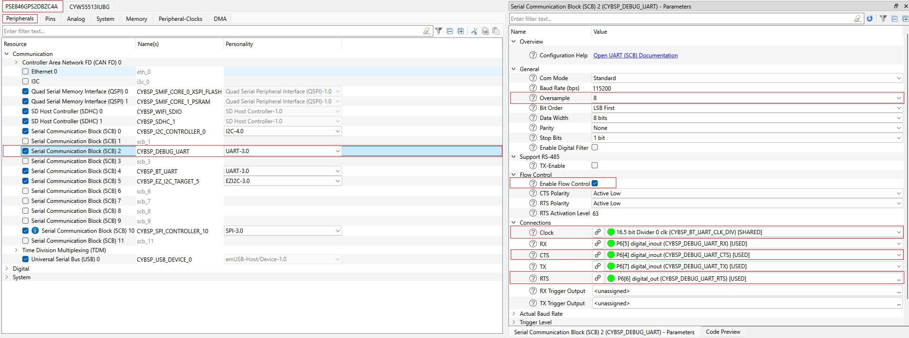

# Airoc-hci-transport

## Overview
The airoc-hci-transport is a utility library, offering a comprehensive solution for extracting debug traces and facilitating communication with external host application.

Developers can use this library to get application/generic traces and Bluetooth protocol (HCI) traces that are useful and essential for in-depth debugging of a Bluetooth application. This library is used with the [BTSPY](https://github.com/Infineon/btsdk-utils) trace utility that is designed to decode and display Bluetooth protocol traces and generic trace messages that are in [WICED HCI packet format](https://github.com/Infineon/btsdk-docs/blob/master/docs/BT-SDK/AIROC-HCI-Control-Protocol.pdf).

Airoc-hci-transport allows user to register a callback function which is invoked when receiving data in WICED HCI format from an external host application over UART. This feature offers an easy and effective way of communication with external host that helps us to develop diverse applications and further enhances the debugging process.

Airoc-hci-transport library needs to be initialized by passing a configuration structure through `cybt_debug_uart_init()`. Configuration structure contains UART configurations such as TX, RX, CTS, RTS pins and the baud rate. Also it optionally contains the callback pointer to receive data from the external host application.

It is important to know that airoc-hci-transport and [retarget-io](https://github.com/Infineon/retarget-io) library are mutually exclusive. This means that both these libraries cannot be used simultaneously in an application on the same UART port. Retartget-io library is primarily used for retarget the standard input/output (STDIO) messages to a UART port which will be useful for application level debugging. If the requirement is to get deep insight into the Bluetooth protocol level behavior of the application or to receive data from external host application, then it is advised to use airoc-hci-transport.

Note: airoc-hci-transport is supported with btstack-integration release-v5.0.0 or higher.

## Quick Start

1. Include "airoc-hci-transport" middleware library using Modustoolbox Library Manager.
    - Open `Library Manager` from ModusToolbox&trade; software environment
    - Open `Add Library` option.
    - Goto Bluetooth&reg; section and select `airoc-hci-transport`.
    - Click `ok` and `update `
2. Include the required header files in the application.
    ```
    #include "cybt_debug_uart.h"
    ```
3. Make necessary changes in the application code.
    - **In case of PSOC™ Edge E84 platform**
        - Use the below structure and call to pass configurations for **PSOC™ Edge E84**. Remaining UART pin configurations should be done using the "Device configurator" tool.
       ```
       #define DEBUG_UART_BAUDRATE   3000000

        cybt_debug_uart_config_t config = {
                              .baud_rate = DEBUG_UART_BAUDRATE,
                              .flow_control = TRUE
        };

        cybt_debug_uart_init(&config, NULL);
       ```

    - **In case of any other platforms**
        - Call `cybt_debug_uart_init(&debug_uart_configuration, NULL);` to initialize airoc-hci-transport library.<br />
        The first argument is the debug_uart_configurations structure pointer, which has UART pin configurations (refer schematic for getting actual port_pin details) along with baud_rate and flow_control configurations. Recommended baudrates supported by the BTSPY tool are 3000000 and 115200. The second argument is an optional callback function which can be set to NULL, if the application doesn't expect any data from an external host application over UART.

            ```
              #define DEBUG_UART_BAUDRATE   3000000
              #define DEBUG_UART_RTS        (P5_2)
              #define DEBUG_UART_CTS        (P5_3)

              cybt_debug_uart_config_t config = {
                                      .uart_tx_pin = CYBSP_DEBUG_UART_TX,
                                      .uart_rx_pin = CYBSP_DEBUG_UART_RX,
                                      .uart_cts_pin = DEBUG_UART_CTS,
                                      .uart_rts_pin = DEBUG_UART_RTS,
                                      .baud_rate = DEBUG_UART_BAUDRATE,
                                      .flow_control = TRUE
              };

              cybt_debug_uart_init(&config, NULL);
            ```

    - On receiving BTM_ENABLED_EVT, register a callback for Bluetooth protocol (HCI) traces using wiced_bt_dev_register_hci_trace()<br />
      Note: If Bluetooth protocol traces are not required, skip this step or do not call cybt_debug_uart_send_hci_trace() in the callback function. Modify the callback function appropriately.
      ```
            wiced_bt_dev_register_hci_trace(hci_trace_cback);
      ```
      Define the callback function in the Application
      ```
            void hci_trace_cback(wiced_bt_hci_trace_type_t type, uint16_t length, uint8_t* p_data)
            {
                cybt_debug_uart_send_hci_trace(type, length, p_data);
            }
      ```
4. If airoc-hci-transport library is included in the application, it is recommended to initialize it (Call `cybt_debug_uart_init()`). By default **ENABLE_AIROC_HCI_TRANSPORT_PRINTF** MACRO (defined in cybt_debug_uart.h) is set to 1 to route the application traces (printf messages) to BTSPY utility. If airoc-hci-transport library is included in the application, with/without initializing it, and `retarget-io` library is to be used to get application traces in Teraterm/putty, then **ENABLE_AIROC_HCI_TRANSPORT_PRINTF** MACRO value needs to be set to 0 in the application makefile.<br/>
    ```
    #define ENABLE_AIROC_HCI_TRANSPORT_PRINTF 0
    ```
    ENABLE_AIROC_HCI_TRANSPORT_PRINTF MACRO is present in cybt_debug_uart.h

5. By default, it is configured to get platform error traces for hardwares that supports [btstack-integration](https://github.com/Infineon/btstack-integration). If required, more traces can be enabled by calling cybt_platform_set_trace_level() in application main() in such platforms.<br />
  cybt_platform_set_trace_level() is defined in cybt_platform_trace.c in [btstack-integration](https://github.com/Infineon/btstack-integration). Set the trace category ID and trace level as per the requirement.<br />
  FYI. Enabling all the logs together may lead to device crash. Recommendation to selectively enable the logs as per debugging needs.
    ```
    cybt_platform_set_trace_level(CYBT_TRACE_ID_STACK, CYBT_TRACE_LEVEL_DEBUG);
    ```

6. Additional steps to enable debug traces only for **CYW5591x**.
    - After calling cybt_debug_uart_init, mandatorily register a callback for debug traces using wiced_bt_dev_register_debug_trace.

      ```
          wiced_bt_dev_register_debug_trace(debug_trace_cback, mpaf_trace_buffer, MPAF_TRACE_BUFFER_SIZE);
      ```

    - Define the callback function in the Application. <br/>
      Modify size of MPAF_TRACE_BUFFER_SIZE when required. For normal use cases, size 1100 is sufficient.

      ```
        #define MPAF_TRACE_BUFFER_SIZE  1100
        char mpaf_trace_buffer[MPAF_TRACE_BUFFER_SIZE];
        typedef void (wiced_bt_debug_trace_cback_t)(char* p_trace_buf, int trace_buf_len, wiced_bt_trace_type_t trace_type);
        extern void wiced_bt_dev_register_debug_trace (wiced_bt_debug_trace_cback_t *p_cback, char* p_trace_buf, int trace_buf_len);

        void debug_trace_cback(char *p_trace_buf, int trace_buf_len, wiced_bt_trace_type_t trace_type)
        {
            cybt_debug_uart_send_trace(trace_buf_len, (uint8_t*)p_trace_buf);
        }
      ```
7. Additional steps to enable debug traces only for **PSOC™ Edge E84**.
    - Open "design.modus" and make the following modifcations for "Serial Communication Block (SCB) 2" (Under "Peripheral" Section) using the "Device configurator" tool.
        - Change the "Oversample" value to 8.
        - Check "Enable flow control" to turn on flow control.
        - Select the Clock as "16.5 bit Divider 0 clk (CYBSP_BT_UART_CLK_DIV)".
        - Select appropriate CTS and RTS pins.

        **Figure 1. Modifications required for SCB 2 only for PSOC™ Edge E84.**

        

8. Download and use [BTSPY](https://github.com/Infineon/btsdk-utils)
    - Click on serial port setup
    - Select "Enable Serial Port"
    - Select the correct baudrate, port number and enable HW flow control

## Memory allocations for HCI protocol/trace logs

Initializing airoc-hci-transport using cybt_debug_uart_init() creates two threads for handling TX and RX data over UART. It also allocates a heap whose size is defined by DEBUG_UART_MEMORY_SIZE. Application developers can tweak the value of this MACRO as per Application requirement.

Stack sizes of TX and RX tasks are defined by DEBUG_UART_TX_TASK_STACK_SIZE and DEBUG_UART_RX_TASK_STACK_SIZE respectively, and queue count of TX task  is defined by DEBUG_UART_TX_TASK_QUEUE_COUNT. Default values of these MACROs are optimized for allowing reasonable amount of traces, but can be modified to suit application's needs.

These MACROs are present in cybt_debug_uart.c

NOTE: If IAR compiler is used, printf in the application calls **__write** function present in the cybt_debug_uart.c to output individual characters. As it receives one character at a time, we use a buffer (printf_buf_iar) to store the characters. The default size of the buffer is 128 bytes (PRINTF_BUF_SIZE_IAR). Application can set it to a convenient size by defining it in the application makefile.

## airoc-hci-transport TX/RX Task Priority
In airoc-hci-transport, the default priority set for both TX and RX tasks is CY_RTOS_PRIORITY_ABOVENORMAL. Generally, it is expected to run airoc-hci-transport tasks at a lower priority compared to bt_task from btstack-integration to ensure smooth working of bluetooth activities. The default priority set for bt_task is CY_RTOS_PRIORITY_HIGH in cybt_platform_task.h present in [btstack-integration](https://github.com/Infineon/btstack-integration).
If airoc-hci-transport TX or RX task require more priority, it can be updated using the below mentioned MACROs defined in cybt_debug_uart.c.

```
#define DEBUG_UART_TX_TASK_PRIORITY      (CY_RTOS_PRIORITY_ABOVENORMAL)
#define DEBUG_UART_RX_TASK_PRIORITY     (CY_RTOS_PRIORITY_ABOVENORMAL)
```

NOTE: If IAR Compiler is used, user may need to change the TX task priority to be the same as that of bt_task i.e. CY_RTOS_PRIORITY_HIGH, to see all the printf traces on the BTSPY. This is due to the limitation of **__write** function of IAR compiler to transmit not more than one char at a time.


© Infineon Technologies, 2024.
